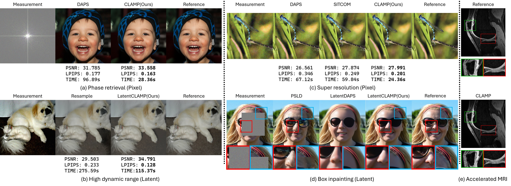

<div align="center">

# Geometry-Correct Diffusion Posterior Sampling with Denoiser-Pullback Curvature Guidance and Manifold-Aligned Damping (ICML 2026)
[](https://arxiv.org/abs/2605.27990) [](https://openreview.net/forum?id=x9Cy1wydfo) [](https://icml.cc/virtual/2026/poster/60728) 
<!-- [](https://clamp2026.github.io/) -->

</div>

## Table of Contents

- [Overview](#overview)
  - [Abstract](#abstract)
  - [Method](#method)
- [Running the Code](#running-the-code)
  - [Installation](#installation)
  - [Quick Start](#quick-start)
- [Acknowledgement](#acknowledgement)
- [Citation](#citation)

## Overview

### Abstract

Diffusion posterior sampling conditions diffusion priors on measurements, but data-consistency updates are typically scaled by hand-tuned guidance weights and can destabilize sampling under stiff, operator-dependent curvature. We replace scalar guidance with a per-noise-level damped Gauss--Newton correction computed in diffusion-state coordinates. The correction pulls likelihood gradients back through the denoiser, uses a one-sided curvature model that avoids forward denoiser Jacobians, and applies diffusion-calibrated rank-one damping aligned with the denoiser residual. Each correction is solved with matrix-free GMRES using automatic differentiation, and sampling proceeds with a variance-preserving Langevin transition with a closed-form drift/noise split. On FFHQ and ImageNet across inverse problems, it achieves competitive PSNR/SSIM/LPIPS while running markedly faster than most of the compared baselines; on accelerated MRI reconstruction, it achieves the best PSNR/SSIM among the compared baselines.

### Method

Overview of our CLAMP-guided diffusion posterior sampling framework. CLAMP replaces hand-tuned scalar likelihood guidance with a denoiser-pullback, curvature-aware damped Gauss–Newton correction that adaptively scales data-consistency updates at each noise level. Combined with manifold-aligned damping, matrix-free GMRES, and variance-preserving Langevin propagation, this principled update enables stable, high-fidelity reconstruction that remains consistent with the input measurements.

## Running the Code

### Installation

1. Create and activate the conda environment:

Required versions:

- Python: `3.10`
- PyTorch: `2.3.0`
- CUDA: `12.1`

```bash
conda create -n fastdips python=3.10 -y
conda activate fastdips
pip install -r requirements.txt
```

2. Checkpoints:

Create the checkpoint directory:

```bash
# in FAST-DIPS folder
mkdir -p checkpoints
```

Required files (`./checkpoints`):

- `ffhq256.pt` (DDPM)
- `imagenet256.pt` (DDPM)
- `ldm_ffhq256.pt` (LDM)
- `ldm_imagenet256.pt` (LDM)
- `GOPRO_wVAE.pth` (nonlinear blur)

Download checkpoints:

- FFHQ DDPM:

```bash
gdown https://drive.google.com/uc?id=1BGwhRWUoguF-D8wlZ65tf227gp3cDUDh -O checkpoints/ffhq256.pt
```

- ImageNet DDPM:

```bash
gdown https://drive.google.com/uc?id=1HAy7P19PckQLczVNXmVF-e_CRxq098uW -O checkpoints/imagenet256.pt
```

- FFHQ LDM:

```bash
wget https://ommer-lab.com/files/latent-diffusion/ffhq.zip -P ./checkpoints
unzip checkpoints/ffhq.zip -d ./checkpoints
mv checkpoints/model.ckpt checkpoints/ldm_ffhq256.pt
rm checkpoints/ffhq.zip
```

- ImageNet LDM:

```bash
wget https://ommer-lab.com/files/latent-diffusion/nitro/cin/model.ckpt -P ./checkpoints/
mv checkpoints/model.ckpt checkpoints/ldm_imagenet256.pt
```

- Nonlinear blur:

```bash
gdown https://drive.google.com/uc?id=1vRoDpIsrTRYZKsOMPNbPcMtFDpCT6Foy -O checkpoints/GOPRO_wVAE.pth
```

3. Datasets:

Create the dataset directory:

```bash
# in FAST-DIPS folder
mkdir -p datasets
```

Download datasets:

- FFHQ:

```bash
gdown https://drive.google.com/uc?id=1i0oI8nt_b9XCHNPKM5KR92Y4t8ZVMDvR -O datasets/test-ffhq.zip
unzip datasets/test-ffhq.zip -d ./datasets
rm datasets/test-ffhq.zip
```

- ImageNet:

```bash
gdown https://drive.google.com/uc?id=1ezXMhLt2UPaqNJnYNQAFM9ZLUW52ulz5 -O datasets/test-imagenet.zip
unzip datasets/test-imagenet.zip -d ./datasets
rm datasets/test-imagenet.zip
```

### Quick Start

Predefined CLI command sets:

- `configs_clamp_cli.txt`

Supported tasks:

- `down_sampling`
- `inpainting`
- `inpainting_rand`
- `gaussian_blur`
- `motion_blur`
- `phase_retrieval`
- `nonlinear_blur`
- `hdr`

Supported spaces: `pixel`, `latent`

Supported datasets: `FFHQ (256 x 256)`, `ImageNet (256 x 256)`

To run ImageNet experiments, replace the dataset/model preset in the FFHQ commands:

- Pixel-space DDPM: `--data test-ffhq --model ffhq256ddpm`
  -> `--data test-imagenet --model imagenet256ddpm`

- Latent-space LDM: `--data test-ffhq --model ffhq256ldm`
  -> `--data test-imagenet --model imagenet256ldm`

## Acknowledgements

This implementation builds upon:

- [DAPS](https://github.com/zhangbingliang2019/DAPS)
- Nonlinear blur operator from [BKSE](https://github.com/VinAIResearch/blur-kernel-space-exploring)
- Motion blur operator from [motionblur](https://github.com/LeviBorodenko/motionblur)

## Citation

```bibtex
@inproceedings{shin2026clamp,
  author    = {Seunghyeok Shin and Minwoo Kim and Dabin Kim and Hongki Lim},
  title     = {Geometry-Correct Diffusion Posterior Sampling with Denoiser-Pullback Curvature Guidance and Manifold-Aligned Damping},
  booktitle = {Proceedings of the 43rd International Conference on Machine Learning},
  series    = {Proceedings of Machine Learning Research},
  volume    = {306},
  year      = {2026},
  publisher = {PMLR}
}
```
